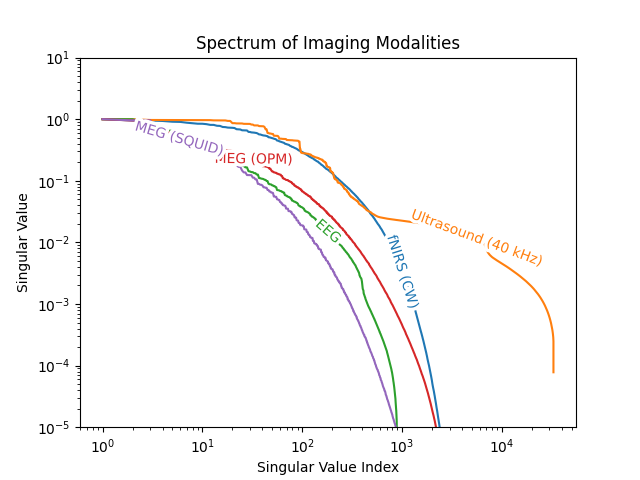

# Grand unified theory of imaging



The idea is each modality has some way of transforming the state of the brain into a set of measurements. By state of brain, we mean, for example, which neurons are firing and when. And by measurements, we mean, like with eeg, you put electrodes on the head and measure voltage. What we’re trying to do is study the function that maps brain state to measurements mathematically and ask how much of the brain state is actually represented in the measurement.

For some imaging modalities, the function is actually linear, so you can represent it as a matrix. So then it becomes like a linear algebra problem!

The linear algebra question we’re asking is something like “how invertible is the matrix?” If it’s invertible, then you can perfectly recover the brain state from the measurements.

Usually in linear algebra, you think of matrix inversion as a binary thing — like either it’s invertible or it’s not. But it’s actually more of a continuous thing once you move to the real world, where you have noise in your measurements. The less binary way of asking how invertible a matrix is, is by looking at its singular values / eigenvalues. If the singular values are close to 0, then you can’t really recover those vector components of your brain state.

## Running the code

```
uv venv
source .venv/bin/activate
uv pip install -e .
uv pip install torch numpy matplotlib ipykernel tqdm jupyter scipy
```
