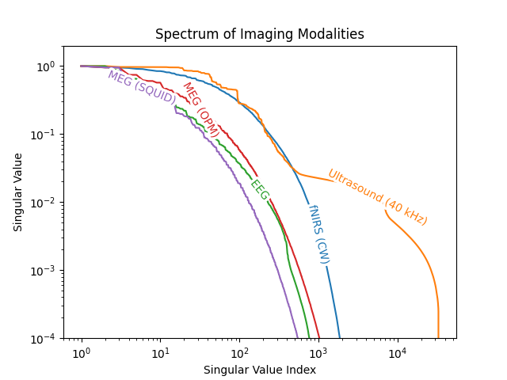

# Grand unified theory of imaging

<!-- BEGIN GENERATED MODALITY CAPACITY SUMMARY -->
### Capacity Summary

| Modality | Sample rate (Hz) | Freq spectrum model | Covariance computation | Output amp | Output noise | SNR | Bit-rate (bits/s) | Capacity / sample (bits) | Total capacity (bits/s) |
| --- | ---: | --- | --- | ---: | ---: | ---: | ---: | ---: | ---: |
| US 2 MHz RBC cone slice 1% CBV | 1 | none; 1 Hz brain-state band; 2 MHz range slice; 1% CBV variability; lambda^3 spatial scaling | Scalar IID 5 mPa pressure noise with 1% CBV cone-scaled RBC operator | 0.723 mPa | 5 mPa | 0.145 | 70.8M | 70.8M | 70.8M |
| MEG SQUID | 100 | power law beta=1.7, 1-100 Hz | EEG spherical Johnson correlation + SQUID scalar diagonal | 100 fT | 10 fT | 10 | 17k | 630 | 63k |
| fNIRS CW | 10 | none; scalar 10 Hz band | Scalar IID diagonal from photon shot noise | 0.001 Delta I / I | 6.188e-05 Delta I / I | 16.2 | 49.3k | 6.13k | 61.3k |
| MEG OPM | 100 | power law beta=1.7, 1-100 Hz | EEG spherical Johnson correlation + OPM scalar diagonal | 100 fT | 50 fT | 2 | 10.3k | 609 | 60.9k |
| EEG | 100 | power law beta=1.4, 1-100 Hz | Layered spherical Johnson impedance covariance | 5 uV | 0.156 uV | 32.1 | 49.8k | 554 | 55.4k |

<!-- END GENERATED MODALITY CAPACITY SUMMARY -->

<!-- BEGIN GENERATED MODALITY NOISE LEVELS -->
### Noise Levels

Per-modality detector noise (per sensor, at the reference sensor count and bandwidth) versus the typical observed output signal, in matching units. Generated by `scripts/make_noise_levels_table.py`.

| Modality | Current noise level | Noise limit | Output amplitude |
| --- | ---: | ---: | ---: |
| EEG | 92.5 nV | 92.5 nV | 5 µV |
| MEG (OPM) | 50 fT | 5 fT | 100 fT |
| MEG (SQUID) | 10 fT | 1 fT | 100 fT |
| CW-fNIRS | 61.9 ppm | 23.4 ppm | 1000 ppm |
| TD-fNIRS | 438 ppm | 165 ppm | 1000 ppm |
| Ultrasound | 0.00208 ppm | 0.00208 ppm | 1000 ppm |
| fMRI (BOLD) | 1.25% | 0.5% | 1% |

Dimensionless quantities (shown as ppm / %): CW- and TD-fNIRS are intensity ratios ΔI/I, Ultrasound is a pressure-amplitude ratio, and fMRI is fractional BOLD signal.

<!-- END GENERATED MODALITY NOISE LEVELS -->

### SVD Spectrum



### Explanation

The idea is each modality has some way of transforming the state of the brain into a set of measurements. By state of brain, we mean, for example, which neurons are firing and when. And by measurements, we mean, like with eeg, you put electrodes on the head and measure voltage. What we’re trying to do is study the function that maps brain state to measurements mathematically and ask how much of the brain state is actually represented in the measurement.

For some imaging modalities, the function is actually linear, so you can represent it as a matrix. So then it becomes like a linear algebra problem!

The linear algebra question we’re asking is something like “how invertible is the matrix?” If it’s invertible, then you can perfectly recover the brain state from the measurements.

Usually in linear algebra, you think of matrix inversion as a binary thing — like either it’s invertible or it’s not. But it’s actually more of a continuous thing once you move to the real world, where you have noise in your measurements. The less binary way of asking how invertible a matrix is, is by looking at its singular values / eigenvalues. If the singular values are close to 0, then you can’t really recover those vector components of your brain state.

### Running the code

```bash
uv run --group blur_1d python run_modality.py blur_1d --no-save
```

Swap in another modality group and command as needed:

```bash
uv run --group cw_fnirs python run_modality.py cw_fnirs --num_sensors 400
```
